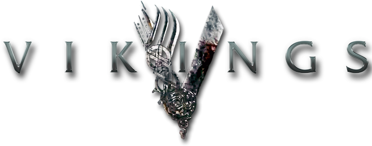
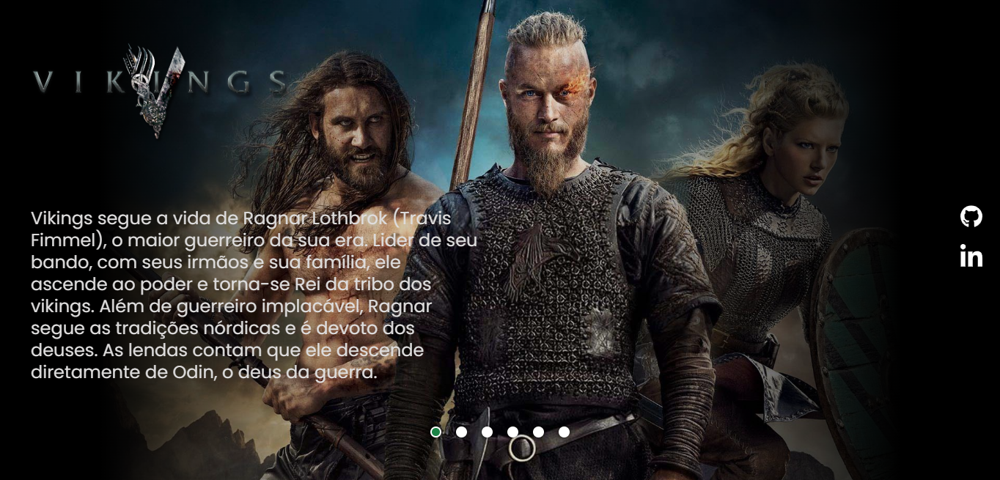

<h1 align='center'> Projeto Vikings ⚔ </h1>
 

Este é um projeto de página de apresentação da série Vikings, onde foi utilizado um carrossel de imagens como fundo, e acrescentado botões para interação com o carrossel.

 

 

<h1 align='center'> Tecnologias 🚀</h1>
 

Esse projeto foi desenvolvido com:

 

    &nbsp;&nbsp;&nbsp;&nbsp;
    &nbsp;&nbsp;&nbsp;&nbsp;
    

 

<h1 align='center'> Um pouco do desenvolvimento 😃</h1>
 

Além da contínua prática das tecnologias (HTML, CSS e JavaScript), refiz alguns detalhes do responsivo do site de acordo com o tema escolhido por mim.
 
 

Para um maior desafio, e aprofundamento na linguagem JS, criei um intervalo de tempo para cada imagem permanecer na tela, mas ainda com a possibilidade de interação com os botões

 

<h1 align='center'> links 🔗 </h1>

    <a href='https://github.com/deivid-rodrigues/projeto-serie-vikings'>Repositório</a>&nbsp;&nbsp;&nbsp; | &nbsp;&nbsp;&nbsp;
    <a href='https://deivid-rodrigues.github.io/projeto-serie-vikings/'>Deploy</a>
</>
